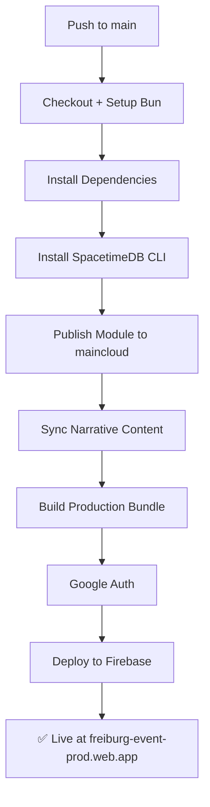

# Local Development & Production Deployment Guide

> Grenzwanderer — Freiburg Detective Narrative

---

## Table of Contents

1. [Prerequisites](#prerequisites)
2. [Environment Architecture](#environment-architecture)
3. [Local Development Setup](#local-development-setup)
4. [Daily Development Workflow](#daily-development-workflow)
5. [Content Authoring Pipeline](#content-authoring-pipeline)
6. [Quality Gates](#quality-gates)
7. [Pushing to Production](#pushing-to-production)
8. [CI/CD Pipeline Reference](#cicd-pipeline-reference)
9. [Admin & Governance](#admin--governance)
10. [Troubleshooting](#troubleshooting)

---

## Prerequisites

| Tool            | Version | Install                                            |
| --------------- | ------- | -------------------------------------------------- |
| **Bun**         | ≥ 1.3   | [bun.sh](https://bun.sh)                           |
| **SpacetimeDB** | 2.0.1   | `curl -sSfL https://install.spacetimedb.com \| sh` |
| **Node.js**     | ≥ 18    | Required for `npx` and some tooling                |
| **Git**         | ≥ 2.40  | With husky hooks enabled                           |

### Repository Secrets (GitHub)

These must be configured in **Settings → Secrets → Actions**:

| Secret                | Purpose                               |
| --------------------- | ------------------------------------- |
| `STDB_OPERATOR_TOKEN` | SpacetimeDB maincloud authentication  |
| `GCP_CREDENTIALS`     | GCP service account JSON for Firebase |
| `GCP_PROJECT_ID`      | Firebase project ID                   |
| `VITE_MAPBOX_TOKEN`   | Mapbox GL token for map features      |
| `GEMINI_API_KEY`      | Gemini API for AI features            |

---

## Environment Architecture

```
┌─────────────────────────────────────────────────────────────────┐
│                        LOCAL (Development)                      │
│                                                                 │
│  SpacetimeDB (localhost:3000)  ←→  Vite Dev Server (:5173)      │
│  Database: grezwandererdata        Profile: freiburg_detective  │
│                                                                 │
│  OpenViking RAG (localhost:1933)                                │
└─────────────────────────────────────────────────────────────────┘
                          │ git push main
                          ▼
┌─────────────────────────────────────────────────────────────────┐
│                     PRODUCTION (Automated)                      │
│                                                                 │
│  SpacetimeDB maincloud           Firebase Hosting               │
│  DB: grezwandererdata            Site: freiburg-event-prod      │
│  Host: maincloud.spacetimedb.com URL: freiburg-event-prod.web.app│
└─────────────────────────────────────────────────────────────────┘
```

---

## Local Development Setup

### 1. Install Dependencies

```bash
bun install
```

### 2. Start the Full Stack (Recommended)

This starts SpacetimeDB, publishes the module, bootstraps admin, extracts content, and launches the dev server — all in one command:

```powershell
bun run dev:all
```

To **preserve the database** between restarts:

```powershell
bun run dev:all:keepdb
```

### 3. Start Components Individually

If you prefer manual control:

```bash
# Terminal 1: Start SpacetimeDB
spacetime start

# Terminal 2: Publish module (first time or after Rust changes)
bun run spacetime:publish:local:clear   # fresh DB
bun run spacetime:publish:local         # preserve data

# Terminal 3: Bootstrap admin access
bun run bootstrap:admin -- --host ws://127.0.0.1:3000 --db grezwandererdata

# Terminal 4: Extract & inject content
bun run content:extract
bun run content:release -- --version 0.2.0 --server local --db grezwandererdata

# Terminal 5: Start dev server
bun run dev:freiburg
```

### 4. Start OpenViking (AI Context Engine)

```powershell
bun run openviking:start
```

Verify:

```powershell
bun run openviking:smoke
```

---

## Daily Development Workflow

### Quick Start

```bash
bun run dev:all:keepdb   # start everything, keep existing data
```

Open http://localhost:5173 in your browser.

### Code Changes (Frontend/Logic)

1. Edit code in `src/`
2. Vite HMR reloads automatically
3. Run tests before committing:

```bash
bun run test
bun run lint
```

### Backend Changes (SpacetimeDB Rust Module)

After editing files in `spacetimedb/`:

```bash
# Rebuild and republish with clean DB
bun run spacetime:publish:local:clear

# Regenerate TypeScript bindings
bun run spacetime:generate

# Re-bootstrap admin
bun run bootstrap:admin -- --host ws://127.0.0.1:3000 --db grezwandererdata

# Re-inject content
bun run content:extract
bun run content:release -- --version 0.2.0 --server local --db grezwandererdata
```

### Narrative Content Changes (Obsidian Markdown)

After editing runtime narrative files in `obsidian/StoryDetective/`:

```bash
# Re-extract the snapshot
bun run content:extract

# Verify content integrity
bun run content:obsidian:coverage:check
bun run content:map:metrics:check

# Inject into local DB
bun run content:release -- --version 0.2.0 --server local --db grezwandererdata
```

`obsidian/Detectiv/` is the design and planning vault. It can reference runtime
concepts, but it is not the canonical source for snapshot extraction.

---

## Content Authoring Pipeline

### File Structure

```
obsidian/
|-- StoryDetective/          # Canonical runtime narrative source
|   `-- 40_GameViewer/       # Runtime scenes parsed by content:extract
|       |-- Case01/Plot/     # Case 01 scenes
|       `-- Sandbox_KA/08_Detective/_runtime/
`-- Detectiv/                # Design and planning documentation
```

### Scene Authoring Cycle

1. **Write**: Create or edit `.md` files in `obsidian/StoryDetective/40_GameViewer/`
2. **Extract**: `bun run content:extract`
3. **Verify**: `bun run content:gate:local`
4. **Test locally**: `bun run content:release -- --version 0.2.0 --server local --db grezwandererdata`
5. **Play**: Open http://localhost:5173 and test the new content

### Content Quality Gate (Full Local)

Run the comprehensive local gate before any push:

```bash
bun run content:gate:local
```

This runs:

- `content:extract` — regenerate snapshot
- `content:obsidian:coverage:check` — verify Obsidian ↔ snapshot parity
- `content:map:metrics:check` — validate map metrics
- `smoke:case01-entry` — entry point smoke test
- `smoke:case01-mainline` — mainline progression smoke
- `smoke:case01-branches` — branch paths smoke
- `content:drift:verify` — snapshot artifact consistency

---

## Quality Gates

### Before Committing

| Gate                  | Command                      | What It Checks                   |
| --------------------- | ---------------------------- | -------------------------------- |
| **Lint**              | `bun run lint`               | ESLint + module binding imports  |
| **Format**            | `bun run format:check`       | Prettier formatting compliance   |
| **Unit Tests**        | `bun run test`               | 550+ unit/integration tests      |
| **Content Integrity** | `bun run content:gate:local` | Full content pipeline validation |

### Before Pushing to Production

```bash
# Full quality release check
bun run quality:release

# Smoke test suite (requires running SpacetimeDB)
bun run smoke:all
```

### Git Hooks (Automatic)

- **pre-commit**: ESLint + Prettier on staged files
- **pre-push**: Full test suite + content drift check

> **Tip**: Use `git push --no-verify` only when pre-push hooks fail on unrelated flaky tests. Never skip for code changes.

---

## Pushing to Production

### Automated Path (Recommended)

Production deployment is **fully automated** via GitHub Actions on push to `main`:

```
git push origin main
```

The CI/CD pipeline (`deploy-prod.yml`) will:

1. ✅ Install dependencies
2. ✅ Install SpacetimeDB CLI
3. ✅ Publish SpacetimeDB module to `maincloud`
4. ✅ Sync narrative content to production DB
5. ✅ Build the Freiburg production bundle
6. ✅ Authenticate with Google Cloud
7. ✅ Deploy to Firebase Hosting

**Result**: https://freiburg-event-prod.web.app/

### Manual Content Release to Production

If you need to push content without a code change:

```bash
# 1. Extract latest content
bun run content:extract

# 2. Run full quality gate
bun run content:gate:local

# 3. Publish directly to maincloud
VERSION=$(node -p "require('./package.json').version")
bun run content:release:freiburg -- --version $VERSION

# 4. Tag the release
bun run content:tag -- --version $VERSION
git push origin --tags
```

### Manual Firebase Deploy (from local machine)

```bash
# Build
bun run build:freiburg

# Deploy (requires firebase login)
firebase login
bun run deploy:firebase:freiburg
```

### Version Bumping

The project version lives in `package.json` (currently `0.2.0`).

- **Automated**: Release Please manages version bumps via PR titles
- **Manual**: Edit `package.json` → `"version": "X.Y.Z"`

---

## CI/CD Pipeline Reference

### Workflows

| Workflow               | Trigger         | Purpose                               |
| ---------------------- | --------------- | ------------------------------------- |
| `ci.yml`               | push/PR to main | Lint, test, build, smoke tests        |
| `deploy-prod.yml`      | push to main    | Full production deployment (Freiburg) |
| `deploy-karlsruhe.yml` | manual          | Karlsruhe event deployment            |
| `preview-artifact.yml` | PR              | Build artifact for PR review          |
| `release-please.yml`   | push to main    | Automated version management          |
| `semantic-pr.yml`      | PR              | PR title format validation            |

### deploy-prod.yml Step-by-Step



---

## Admin & Governance

### Granting Admin Access to CI Runner

If the CI pipeline fails with `Only an admin identity can grant admin identities`:

1. **Find the CI runner identity** in the GitHub Actions logs:

   ```
   ℹ️ INFO Connected as Identity: 0x<HEX>
   ```

2. **Grant admin access** from your local machine:

   ```bash
   bun run governance:admin:grant -- \
     --identity <HEX_FROM_LOGS> \
     --server maincloud \
     --db grezwandererdata
   ```

3. **Re-run** the failed GitHub Actions job.

> **Note**: This is a one-time operation per CI runner identity. The identity is stable across runs unless GitHub rotates the runner's SpacetimeDB credentials.

### Checking Database Status

```bash
# Local
bun run content:db:status -- --server local --db grezwandererdata

# Production
bun run content:db:status -- --server maincloud --db grezwandererdata
```

### Content Rollback

If bad content reaches production:

```bash
# 1. Find the target checksum in the manifest
cat content/vn/releases.manifest.json

# 2. Rollback
bun run content:rollback -- \
  --checksum <TARGET_SHA256> \
  --server maincloud \
  --db grezwandererdata
```

---

## Troubleshooting

### `Only an admin identity can grant admin identities`

**Cause**: The CI runner identity doesn't have admin privileges on the production DB.

**Fix**: See [Granting Admin Access to CI Runner](#granting-admin-access-to-ci-runner) above.

---

### `Failed to authenticate, have you run firebase login?`

**Cause**: Firebase CLI can't find GCP credentials.

**Fix (CI)**: Ensure `GCP_CREDENTIALS` secret contains a valid service account JSON key with Firebase Hosting permissions.

**Fix (local)**:

```bash
firebase login
```

---

### `checksum does not match payload content`

**Cause**: The snapshot file was edited manually or is stale.

**Fix**:

```bash
bun run content:extract
```

---

### `Schema mismatch` errors

**Cause**: The SpacetimeDB module expects a different schema version than the snapshot.

**Fix**:

```bash
# Republish module first
bun run spacetime:publish:local:clear
# Then re-extract
bun run content:extract
```

---

### Content warnings in extraction

| Warning                  | Severity | Action                                          |
| ------------------------ | -------- | ----------------------------------------------- |
| `OUT_OF_SCOPE_NEXT`      | Info     | Expected — choice targets outside current scope |
| `UNREACHABLE_NODE`       | Info     | Node excluded from onboarding graph by design   |
| `MISSING_LOCALE_VARIANT` | Warning  | Add missing `ru` locale files when ready        |
| `ORPHAN_SCENE_FILE`      | Warning  | Register scene in `scene_order` or remove file  |

---

### Flaky pre-push hook (timer teardown error)

**Symptom**: `This error was caught after test environment was torn down`

**Workaround**:

```bash
git push --no-verify
```

**Proper fix**: Add `clearTimeout` / `clearInterval` cleanup in the affected test file.

---

## Quick Reference Card

```bash
# ── LOCAL DEV ──────────────────────────────
bun run dev:all                    # start everything (clean DB)
bun run dev:all:keepdb             # start everything (keep data)
bun run dev:freiburg               # dev server only

# ── CONTENT ────────────────────────────────
bun run content:extract            # regenerate snapshot
bun run content:gate:local         # full content validation
bun run content:release -- --version 0.2.0 --server local --db grezwandererdata

# ── QUALITY ────────────────────────────────
bun run test                       # unit tests
bun run lint                       # linting
bun run quality:release            # full release check
bun run smoke:all                  # full smoke suite

# ── PRODUCTION ─────────────────────────────
git push origin main               # triggers auto-deploy
bun run content:release:freiburg -- --version X.Y.Z   # manual content push

# ── ADMIN ──────────────────────────────────
bun run governance:admin:grant -- --identity <HEX> --server maincloud --db grezwandererdata
bun run content:db:status -- --server maincloud --db grezwandererdata
bun run content:rollback -- --checksum <SHA> --server maincloud --db grezwandererdata
```
