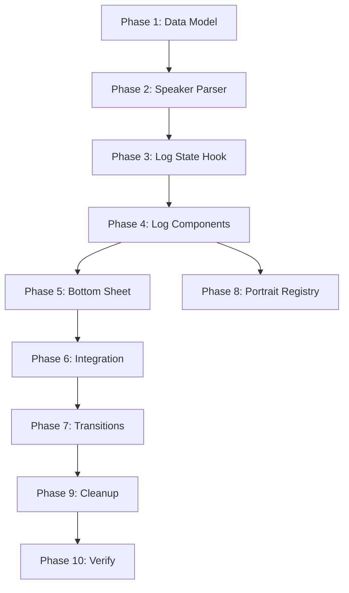

# Накопительный текстовый лог (Disco Elysium / Rogue Trader стиль)

Переработка `VnNarrativePanel` из режима «один экран = одна нода» в накопительный скроллящийся лог с портретами, стилизованными спикерами и inline-выборами.

## Сводка решений

| #   | Решение          | Ответ                                                                   |
| --- | ---------------- | ----------------------------------------------------------------------- |
| 1   | Граница сцены    | Явный `sceneGroupId` на VnNode                                          |
| 2   | Видео-ноды       | Изолированные, вне лога                                                 |
| 3   | Хранение лога    | Фронтенд-стейт, сброс при смене sceneGroupId                            |
| 4   | Выборы/чеки      | Текст выбора + результат чека inline в логе                             |
| 5   | Парсинг текста   | Regex на фронте по `**[Speaker]**:`                                     |
| 6   | Компоновка       | Панель снизу + drag handle + Rogue Trader dimming                       |
| 7   | Выборы lifecycle | Inline, staggered fade-in, выбранный → запись, невыбранные → fade-out   |
| 8   | Стили спикеров   | 4 категории, палитры из innerVoiceContract                              |
| 9   | Layout-режимы    | 3: `fullscreen`, `letter_overlay`, `log` (заменяет split + thought_log) |
| 10  | TypedText        | Построчно по сегментам спикеров                                         |
| 11  | Tap              | Skip typing → tap → next segment                                        |
| 12  | Шторка           | Handle 32px, snaps 25/45/95%, localStorage                              |
| 13  | Переход сцен     | Fade-out → crossfade bg → slide-up чистая панель                        |
| 14  | UI cleanup       | Убрать character tab + tap-to-continue, inline voice hints              |
| 15  | Speaker collapse | Не дублировать портрет подряд идущих реплик одного спикера              |

---

## Phase 1: Data Model

> Добавить `sceneGroupId` в тип `VnNode` и заполнить для Case 01.

### [MODIFY] [types.ts](file:///f:/proje/grenzwanderer/Grenzwanderer/src/shared/vn-contract/types.ts)

- Добавить `sceneGroupId?: string` в `VnNode` (строка ~230)
- Добавить `"log"` в `VnNarrativeLayout` (строка ~207), оставив `split` и `thought_log` для обратной совместимости

### [MODIFY] [parser.ts](file:///f:/proje/grenzwanderer/Grenzwanderer/src/shared/vn-contract/parser.ts)

- Обновить `isNarrativeLayout` валидатор, добавить `"log"`
- Добавить `sceneGroupId` в парсинг VnNode

### [MODIFY] [case01_canon_runtime.ts](file:///f:/proje/grenzwanderer/Grenzwanderer/scripts/data/case01_canon_runtime.ts)

- Добавить `sceneGroupId` ко всем нодам первого сценария:

```
train_bahn_video       → opening_arrival_video (fullscreen video, isolated)
train_compartment      → train_compartment_cinema, train_compartment_letter
train_assistant        → train_assistant_intro, train_door_creaks, train_assistant_departure
train_ankommen_video   → train_ankommen_video (fullscreen video, isolated)
train_voza_video       → train_voza_cutscene (fullscreen video, isolated)
platform_disembark     → train_disembark_journal
hbf_hall               → beat1_atmosphere
hbf_newsboy            → hbf_newsboy
hbf_luggage            → hbf_luggage
hbf_police             → hbf_police
```

- Заменить `narrativeLayout: "split"` на `"log"` и `narrativeLayout: "thought_log"` на `"log"` для нод, которые участвуют в логе
- Видео-ноды остаются с `narrativeLayout: "fullscreen"`

### [MODIFY] [vn-blueprint-types.ts](file:///f:/proje/grenzwanderer/Grenzwanderer/scripts/vn-blueprint-types.ts)

- Добавить `sceneGroupId?: string` в `NodeBlueprint`

---

## Phase 2: Speaker Segment Parser

> Новый утилитарный модуль: парсит `bodyOverride` в массив сегментов.

### [NEW] [speakerParser.ts](file:///f:/proje/grenzwanderer/Grenzwanderer/src/features/vn/log/speakerParser.ts)

```ts
export type SpeakerCategory = "narrator" | "npc" | "inner_voice" | "player";

export interface SpeakerSegment {
  speaker: string; // raw: "Narrator", "Assistant", "inner_cynic"
  speakerLabel: string; // display: "Narrator", "Assistant", "Cynic"
  category: SpeakerCategory;
  text: string;
  portraitUrl?: string; // resolved from registry
  accentColor?: string; // from innerVoiceContract palette
  textColor?: string;
}

export function parseSpeakerSegments(body: string): SpeakerSegment[];
```

- Regex: split по `/\*\*\[(.+?)\]\*\*:\s*/`
- Text без `**[...]**:` prefix → category `"narrator"`
- `inner_*` → category `"inner_voice"`, цвета из `INNER_VOICE_DEFINITIONS[id].palette`
- Всё остальное → category `"npc"`

### [NEW] [speakerParser.test.ts](file:///f:/proje/grenzwanderer/Grenzwanderer/src/features/vn/log/speakerParser.test.ts)

- Тесты: парсинг narrator-only, mixed speakers, inner voices, edge cases

---

## Phase 3: Log State Management

> React hook для управления накопленным логом.

### [NEW] [useNarrativeLog.ts](file:///f:/proje/grenzwanderer/Grenzwanderer/src/features/vn/log/useNarrativeLog.ts)

```ts
export type LogEntryType = "segment" | "player_choice" | "skill_check_result";

export interface LogEntry {
  id: string;                    // unique key for React
  type: LogEntryType;
  nodeId: string;                // source VnNode
  segment?: SpeakerSegment;      // for type "segment"
  choiceText?: string;           // for type "player_choice"
  checkResult?: {                // for type "skill_check_result"
    voiceLabel: string;
    passed: boolean;
    roll: number;
    dc: number;
  };
  timestamp: number;
}

export interface NarrativeLogState {
  entries: LogEntry[];
  currentNodeSegments: SpeakerSegment[];  // segments of current node
  currentSegmentIndex: number;            // which segment is being typed
  isTypingSegment: boolean;
  sceneGroupId: string | null;
}

export function useNarrativeLog(
  currentNode: VnNode | null,
  sceneGroupId: string | null,
): {
  state: NarrativeLogState;
  advanceSegment: () => void;       // show next segment
  finishCurrentSegment: () => void; // skip typing of current
  appendChoice: (text: string) => void;
  appendCheckResult: (result: ...) => void;
  resetLog: () => void;
};
```

**Логика:**

- При смене `currentNode` (но тот же `sceneGroupId`): все сегменты предыдущей ноды добавляются в `entries[]`, парсятся новые сегменты, `currentSegmentIndex = 0`
- При смене `sceneGroupId`: `entries = []`, полный сброс
- `advanceSegment`: инкрементирует `currentSegmentIndex`, предыдущий сегмент уходит в `entries[]`
- `finishCurrentSegment`: вызывает TypedText.finish()

---

## Phase 4: Core Log Component

> Основной компонент отображения лога.

### [NEW] [VnNarrativeLog.tsx](file:///f:/proje/grenzwanderer/Grenzwanderer/src/features/vn/log/VnNarrativeLog.tsx)

**Структура:**

```
<div className="vn-log-container" ref={scrollRef}>
  {/* Past entries — dimmed */}
  {entries.map(entry => <LogEntryRenderer key={entry.id} entry={entry} dimmed />)}

  {/* Current node segments — shown up to currentSegmentIndex */}
  {revealedSegments.map((seg, i) => (
    <LogSegmentRenderer
      key={...}
      segment={seg}
      isActive={i === currentSegmentIndex}
      showSpeaker={seg.speaker !== prevSpeaker}  // consecutive collapse
    />
  ))}

  {/* Active typing segment */}
  <LogSegmentRenderer
    segment={currentSegment}
    isTyping={true}
    showSpeaker={...}
  />

  {/* Choices (when all segments done) */}
  {allSegmentsDone && <LogChoicesRenderer ... />}
</div>
```

### [NEW] [LogSegmentRenderer.tsx](file:///f:/proje/grenzwanderer/Grenzwanderer/src/features/vn/log/LogSegmentRenderer.tsx)

Рендерит один сегмент с правильным стилем:

| Category      | Portrait                 | Name style                     | Text style                    |
| ------------- | ------------------------ | ------------------------------ | ----------------------------- |
| `narrator`    | Нет                      | Нет                            | Курсив, `stone-400`           |
| `npc`         | Circle 32px, из registry | Amber uppercase, tracking-wide | `stone-200`, обычный          |
| `inner_voice` | Цветная иконка           | Мелкий caps, цвет из palette   | Курсив, тинт palette.text     |
| `player`      | Нет                      | Нет                            | Amber-300, жирный, маркер `▸` |

- `dimmed` prop → `opacity-50` + `transition-opacity duration-500`
- `isTyping` prop → рендерит `TypedText` вместо статического текста
- `showSpeaker` prop → показывает/скрывает портрет и имя (consecutive collapse)

### [NEW] [LogChoicesRenderer.tsx](file:///f:/proje/grenzwanderer/Grenzwanderer/src/features/vn/log/LogChoicesRenderer.tsx)

Рендерит варианты выбора inline в логе:

- Staggered fade-in (100ms между кнопками)
- Inner voice hints как мини-сегменты перед кнопками
- При выборе: selected → transforms to player log entry (300ms), unselected → fade-out + height collapse (200ms)
- Skill check result → compact line `⚂ Voice [Result — roll vs DC]` с иконкой

### [NEW] [LogEntryRenderer.tsx](file:///f:/proje/grenzwanderer/Grenzwanderer/src/features/vn/log/LogEntryRenderer.tsx)

Маршрутизатор: рендерит `LogSegmentRenderer`, `LogChoiceEntry` или `LogCheckResultEntry` по `entry.type`.

---

## Phase 5: Bottom Sheet с Drag Handle

> Панель снизу экрана с перетаскиванием.

### [NEW] [useBottomSheet.ts](file:///f:/proje/grenzwanderer/Grenzwanderer/src/shared/hooks/useBottomSheet.ts)

```ts
export function useBottomSheet(options: {
  snapPoints: number[]; // [0.25, 0.45, 0.95]
  defaultSnap: number; // 0.45
  storageKey?: string; // localStorage key
  onSnapChange?: (snap: number) => void;
}): {
  heightPercent: number;
  handleRef: React.RefObject<HTMLDivElement>;
  contentRef: React.RefObject<HTMLDivElement>;
  resetToDefault: () => void;
};
```

**Логика:**

- `pointerdown` на handle-зону → начать drag
- `pointermove` → вычислить высоту в % от viewport
- `pointerup` → snap к ближайшей точке с `transition: height 300ms ease-out`
- Touch внутри `contentRef` → обычный scroll (не drag)
- Сохранение в `localStorage` (ключ `vn-log-sheet-snap`)
- `resetToDefault()` — вызывается при смене `sceneGroupId`

### [NEW] [VnLogBottomSheet.tsx](file:///f:/proje/grenzwanderer/Grenzwanderer/src/features/vn/log/VnLogBottomSheet.tsx)

```
<div style={{ height: `${heightPercent}vh` }}>
  {/* Handle zone — 32px, drag target */}
  <div ref={handleRef} className="h-8 flex items-center justify-center cursor-grab">
    <div className="w-10 h-1 rounded-full bg-white/20" />
  </div>

  {/* Amber accent line */}
  <div className="h-[2px] bg-gradient-to-r from-transparent via-amber-600/80 to-transparent" />

  {/* Scrollable log content */}
  <div ref={contentRef} className="flex-1 overflow-y-auto">
    <VnNarrativeLog ... />
  </div>
</div>
```

---

## Phase 6: Интеграция в VnNarrativePanel

> Обновить панель для поддержки нового `log` режима.

### [MODIFY] [VnNarrativePanel.tsx](file:///f:/proje/grenzwanderer/Grenzwanderer/src/widgets/vn-overlay/VnNarrativePanel.tsx)

**Изменения:**

- Новый prop: `sceneGroupId?: string`
- Новый prop: `logEntries` и `logState` (из `useNarrativeLog`)
- Когда `narrativeLayout === "log"`:
  - Рендерить `VnLogBottomSheet` вместо текущего split-блока (строки 538-603)
  - Убрать character name tab (строки 549-559)
  - Убрать "Tap to continue" (из `VnNarrativeText`)
  - Location header — **оставить** поверх фона
- Когда `narrativeLayout === "fullscreen"` или `"letter_overlay"` — **без изменений**
- Удалить `#region agent log` debug-блоки (строки 181, 207, 266, 270, 280, 292, 298, 303)

### [MODIFY] [VnScreen.tsx](file:///f:/proje/grenzwanderer/Grenzwanderer/src/features/vn/ui/VnScreen.tsx)

**Изменения:**

- Добавить `useNarrativeLog` hook
- Передать `sceneGroupId` из `currentNode?.sceneGroupId` в `VnNarrativePanel`
- Обновить `effectiveNarrativeLayout` (строка 470): маппить `"split"` → `"log"`, `"thought_log"` → `"log"`
- Обновить `handleSurfaceTap` для нового log-поведения (segment advance вместо auto-continue)
- Обновить `handleChoiceClick` — записывать выбор в лог через `appendChoice`
- Удалить `#region agent log` debug-блоки

---

## Phase 7: Scene Transition Animations

> Анимации при смене sceneGroupId.

### [MODIFY] [VnLogBottomSheet.tsx](file:///f:/proje/grenzwanderer/Grenzwanderer/src/features/vn/log/VnLogBottomSheet.tsx)

- При смене `sceneGroupId`:
  1. CSS class `vn-log-exit` → opacity 0 + translateY(100%) за 400ms
  2. После 400ms: reset лога, reset snap to default
  3. CSS class `vn-log-enter` → opacity 1 + translateY(0) за 400ms

### [MODIFY] [VnNarrativePanel.tsx](file:///f:/proje/grenzwanderer/Grenzwanderer/src/widgets/vn-overlay/VnNarrativePanel.tsx)

- Background crossfade: текущий механизм `transition-opacity duration-1000` уже работает (строка 354)

---

## Phase 8: Portrait Resolution

> Резолвинг портретов по speakerId.

### [NEW] [speakerRegistry.ts](file:///f:/proje/grenzwanderer/Grenzwanderer/src/features/vn/log/speakerRegistry.ts)

```ts
export function resolveSpeakerPortrait(
  speakerId: string,
  snapshot: VnSnapshot | null,
): string | undefined;
```

- Проверяет `socialCatalog.npcIdentities` → `portraitUrl`
- Проверяет `originProfiles` → `dossier.avatarUrl` для PC-спикеров
- Fallback: undefined (без портрета)

---

## Phase 9: Cleanup

### [DELETE or SIMPLIFY] Убрать устаревший код:

- `VnNarrativeText.tsx` — убрать "Tap to continue" dots и progress bar
- `NoirTypography.tsx` — оценить нужность; если не используется нигде кроме `VnNarrativeText`, удалить
- `VnNarrativePanel.tsx` — убрать все `#region agent log` блоки (12+ мест)
- `VnScreen.tsx` — убрать все `#region agent log` блоки

---

## Phase 10: Re-extract & Verify

### Команды:

```bash
# Пересобрать контент с новыми sceneGroupId
bun run content:extract

# Переопубликовать в базу
bun run scripts/content-release.ts --version 0.1.0 --host http://127.0.0.1:3001 --db grezwandererdata

# Запустить dev сервер
bun run dev -- --port 5174 --force
```

### Ручная проверка:

1. Выбрать Elias → Begin Investigation
2. Видео Bahn.mp4 → звуковой промпт → полноэкранное видео (**fullscreen** режим)
3. Переход в купе → **log** режим, текст печатается по сегментам
4. Письмо → **letter_overlay** режим (без изменений)
5. Сцены с ассистентом → 3 ноды в одном логе, портрет ассистента показан один раз
6. Tap → skip typing текущего сегмента, tap → следующий сегмент
7. HBF → выбор из 3 вариантов inline в логе
8. Выбор → transform в запись, невыбранные → fade-out
9. Шторка → drag вверх/вниз, snap points работают
10. Перезагрузка → лог сброшен, текущая нода отображается

---

## Порядок реализации



**Оценка объёма:**

- Phase 1-2: ~2 часа (типы + парсер + тесты)
- Phase 3-4: ~4 часа (основная логика + компоненты)
- Phase 5: ~2 часа (drag handle)
- Phase 6-7: ~3 часа (интеграция + анимации)
- Phase 8-9: ~1 час (портреты + cleanup)
- Phase 10: ~30 мин (верификация)

**Итого: ~12-13 часов работы**

---

## Новые файлы (8)

| Файл                                         | Назначение                             |
| -------------------------------------------- | -------------------------------------- |
| `src/features/vn/log/speakerParser.ts`       | Парсер bodyOverride → SpeakerSegment[] |
| `src/features/vn/log/speakerParser.test.ts`  | Тесты парсера                          |
| `src/features/vn/log/useNarrativeLog.ts`     | Хук управления логом                   |
| `src/features/vn/log/VnNarrativeLog.tsx`     | Основной компонент лога                |
| `src/features/vn/log/LogSegmentRenderer.tsx` | Рендер одного сегмента                 |
| `src/features/vn/log/LogChoicesRenderer.tsx` | Рендер выборов inline                  |
| `src/features/vn/log/LogEntryRenderer.tsx`   | Маршрутизатор entry-типов              |
| `src/features/vn/log/speakerRegistry.ts`     | Резолвер портретов                     |
| `src/shared/hooks/useBottomSheet.ts`         | Хук drag-to-resize                     |
| `src/features/vn/log/VnLogBottomSheet.tsx`   | Обёртка bottom sheet                   |

## Модифицируемые файлы (6)

| Файл                                          | Изменения                        |
| --------------------------------------------- | -------------------------------- |
| `src/shared/vn-contract/types.ts`             | `sceneGroupId`, `"log"` layout   |
| `src/shared/vn-contract/parser.ts`            | Валидация новых полей            |
| `scripts/data/case01_canon_runtime.ts`        | sceneGroupId + layout обновления |
| `scripts/vn-blueprint-types.ts`               | sceneGroupId в blueprint         |
| `src/widgets/vn-overlay/VnNarrativePanel.tsx` | Log-режим, cleanup debug         |
| `src/features/vn/ui/VnScreen.tsx`             | useNarrativeLog, layout routing  |
