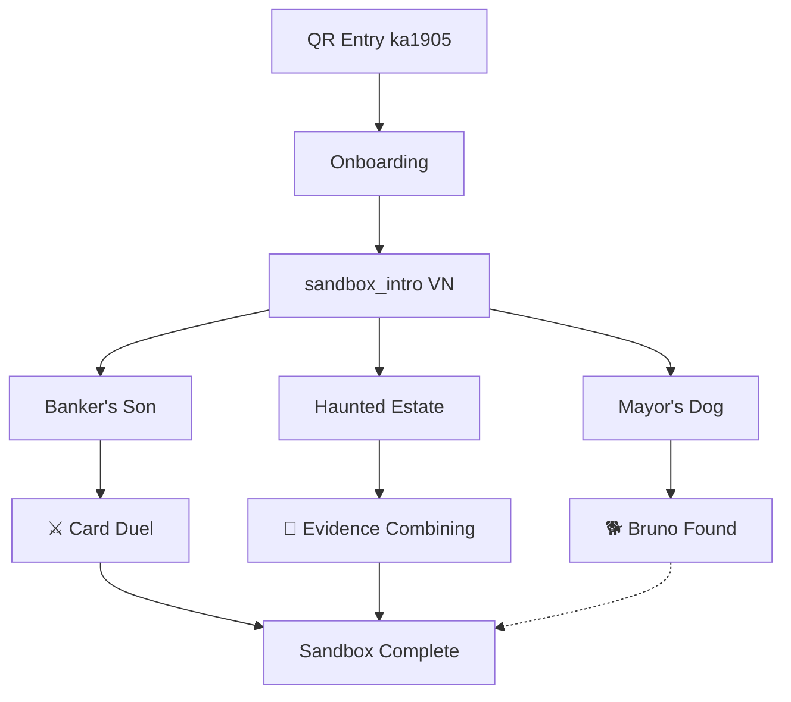
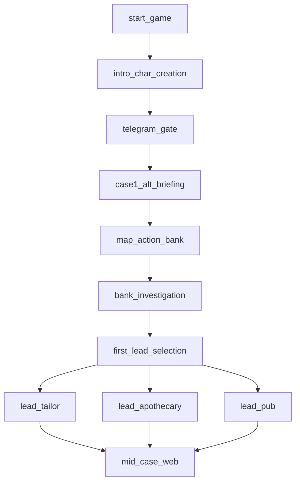
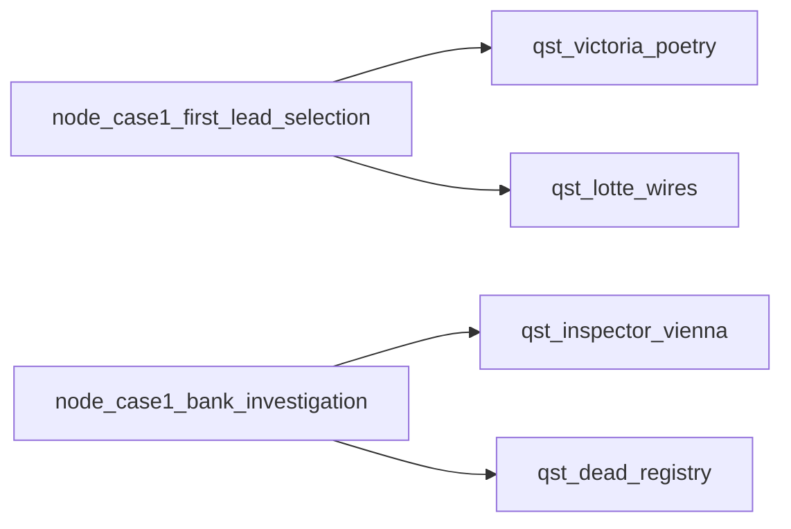

---
id: moc_quests
tags:
  - type/moc
  - domain/narrative
---

# MOC Quests

## Main

- [[00_Map_Room/qst_main_case_01|qst_main_case_01]]

## Side

- [[00_Map_Room/qst_victoria_poetry|qst_victoria_poetry]]
- [[00_Map_Room/qst_lotte_wires|qst_lotte_wires]]
- [[00_Map_Room/qst_inspector_vienna|qst_inspector_vienna]]
- [[00_Map_Room/qst_dead_registry|qst_dead_registry]]

## Karlsruhe Sandbox (ka1905)

- [[00_Map_Room/qst_sandbox_karlsruhe|qst_sandbox_karlsruhe]] — Meta quest
- [[00_Map_Room/qst_sandbox_banker|qst_sandbox_banker]] — Banker's Son (card duel)
- [[00_Map_Room/qst_sandbox_dog|qst_sandbox_dog]] — Mayor's Dog (optional, breadcrumbs)
- [[00_Map_Room/qst_sandbox_ghost|qst_sandbox_ghost]] — Haunted Estate (deduction)

## Karlsruhe Sandbox Flow

## Case 01 Stage Flow

## Side Quest Hooks

