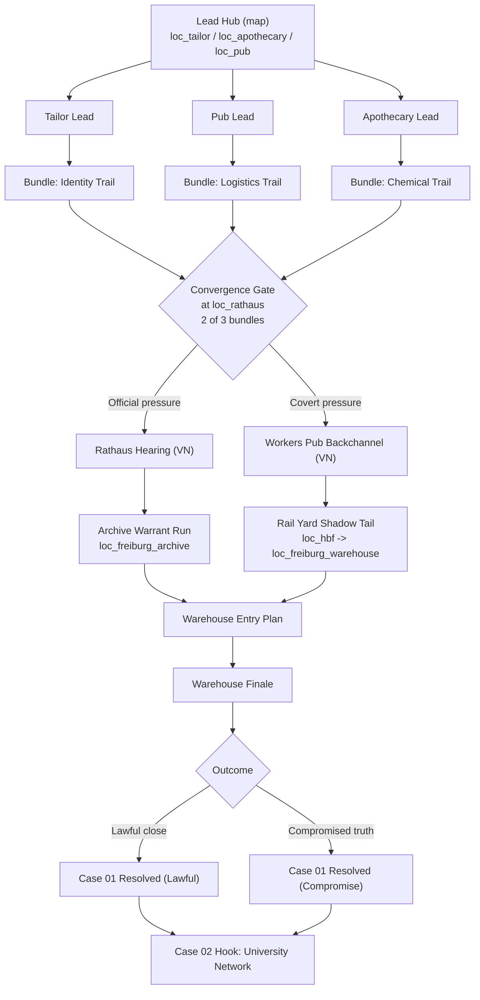

# Story Graph: Case 01 Forward Arc

## Purpose

Production-level структура продолжения после [[10_Narrative/Scenes/node_case1_first_lead_selection|Node: Case 1 First Lead Selection]], в игровом формате: map-hubs, зацепки, проверки, soft-fail и recovery.

## Scope

- Entry stage: `case01=leads_open`.
- Exit stage: `case01=resolved` + hook на следующий кейс.
- Runtime foundations:
  - карта и биндинги: `apps/server/src/scripts/data/case_01_points.ts`
  - квест-пайплайн: `apps/web/src/features/quests/case01_act1.logic.ts`

## Flow Graph

## Hook Bundle Contracts

### Bundle 1: Identity Trail

- Sources:
  - `clue_hartmann_tailor_route`
  - `clue_box217_costume_storage`
  - `clue_hartmann_cash_runner`
- Unlock intent:
  - открывает «официальное давление» в ратуше без штрафа к отношениям.

### Bundle 2: Logistics Trail

- Sources:
  - `clue_night_guard_pub_confirmed`
  - `clue_previous_investigator_last_seen_pub`
  - `heard_warehouse_rumor`
- Unlock intent:
  - открывает скрытую точку входа в `loc_freiburg_warehouse`.

### Bundle 3: Chemical Trail

- Sources:
  - `clue_chemical_sender_confirmed`
  - `clue_sender_route_to_kiliani`
  - `ev_university_formula`
- Unlock intent:
  - усиливает доказательную базу в финальном допросе.

## Gate Rules (Map + VN)

### Gate G1: Convergence at Rathaus

- Condition:
  - минимум 2 активных bundle-флага.
- Success:
  - выбор маршрута: `official` или `covert`.
- Soft-fail:
  - при 0-1 bundle игрок получает fallback-задачу «добрать 1 зацепку»; критический путь не блокируется.

### Gate G2: Warehouse Entry Plan

- Condition:
  - `warrant_ready=true` или `covert_entry_ready=true`.
- Success:
  - старт финальной warehouse-сцены.
- Soft-fail:
  - при провале проверки route остаётся доступен через альтернативную ветку (юридическую или подпольную).

## Planned Node Backlog

- [[10_Narrative/Scenes/node_case1_convergence_rathaus_gate|Node: Case 1 Convergence Rathaus Gate]] (layer/map)
- [[10_Narrative/Scenes/node_case1_rathaus_hearing|Node: Case 1 Rathaus Hearing]] (layer/vn)
- [[10_Narrative/Scenes/node_case1_workers_backchannel|Node: Case 1 Workers Backchannel]] (layer/vn)
- [[10_Narrative/Scenes/node_case1_archive_warrant_run|Node: Case 1 Archive Warrant Run]] (layer/vn)
- [[10_Narrative/Scenes/node_case1_lotte_interlude_warning|Node: Case 1 Lotte Interlude Warning]] (layer/vn)
- [[10_Narrative/Scenes/node_case1_rail_yard_shadow_tail|Node: Case 1 Rail Yard Shadow Tail]] (layer/map)
- [[10_Narrative/Scenes/node_case1_warehouse_entry_plan|Node: Case 1 Warehouse Entry Plan]] (layer/system)
- [[10_Narrative/Scenes/node_case1_finale_resolution_split|Node: Case 1 Finale Resolution Split]] (layer/vn)

## Safety and Recovery

- Нет mandatory hard fail: любой провал даёт reroute, cost или delayed advantage.
- Любой маршрут ведёт к `Warehouse Entry Plan`.
- Выбор маршрута меняет цену (отношения/ресурсы/тон финала), но не ломает прогрессию.

## Board Link

- [[00_Map_Room/Mechanics_Rollout_Case01|Mechanics Rollout: Case 01]]
- Основная доска: [[00_Map_Room/Gameplay_Story_Board|Gameplay_Story_Board]]
- Протокол: [[99_System/Narrative_Gameplay_Protocol|Narrative_Gameplay_Protocol]]
- Чеклист: [[99_System/Narrative_Gameplay_Checklist|Narrative_Gameplay_Checklist]]
