---
id: tech_supabase_schema
tags:
  - type/tech
  - status/stable
---

# Tech Supabase Schema

Primary sources:

- `apps/server/src/db/schema.ts`
- `apps/server/drizzle/*.sql`

## ER Diagram

```mermaid
erDiagram
  USERS ||--o{ USER_INVENTORY_SNAPSHOTS : has
  USERS ||--o{ USER_DOSSIER_SNAPSHOTS : has
  USERS ||--o{ USER_MAP_POINT_USER_STATES : has
  USERS ||--o{ USER_QUESTS : has
  USERS ||--o{ DETECTIVE_SAVES : has
  USERS ||--o{ WORLD_CLOCKS : has
  USERS ||--o{ TRAVEL_SESSIONS : has
  USERS ||--o{ USER_CASE_PROGRESS : has
  USERS ||--o{ PLAYER_PROGRESSION : has
  USERS ||--o{ VOICE_PROGRESSION : has
  USERS ||--o{ USER_FACTION_REPUTATION : has
  USERS ||--o{ USER_CHARACTER_RELATIONS : has
  USERS ||--o{ USER_EVIDENCE : has
  USERS ||--o{ DOMAIN_EVENT_LOG : has

  CASES ||--o{ CASE_OBJECTIVES : includes
  CASES ||--o{ USER_CASE_PROGRESS : tracked_in
  FACTIONS ||--o{ USER_FACTION_REPUTATION : tracked_in
  MAP_POINTS ||--o{ USER_MAP_POINT_USER_STATES : state_for
  EVIDENCE_CATALOG ||--o{ USER_EVIDENCE : discovered
```

## Table Map

- Core identity/content:
  - `users`, `scenarios`, `items`
- Map + lifecycle:
  - `map_points`, `user_map_point_user_states`, `event_codes`
- Quest/VN:
  - `quests`, `user_quests`, `detective_saves`
- Engine progression:
  - `world_clocks`, `city_routes`, `travel_sessions`, `cases`, `case_objectives`, `user_case_progress`, `player_progression`, `voice_progression`, `factions`, `user_faction_reputation`, `user_character_relations`, `evidence_catalog`, `user_evidence`, `domain_event_log`
- Snapshot persistence:
  - `user_inventory_snapshots`, `user_dossier_snapshots`

## JSONB Field Semantics

| Table                        | Field                  | Purpose                                 |
| ---------------------------- | ---------------------- | --------------------------------------- |
| `scenarios`                  | `content`              | VN scenario payload                     |
| `items`                      | `data`                 | item type-specific extensions           |
| `user_inventory_snapshots`   | `items`                | normalized inventory stacks             |
| `user_dossier_snapshots`     | `data`                 | dossier state snapshot                  |
| `map_points`                 | `bindings`             | trigger-action DSL for map interactions |
| `map_points`                 | `data`                 | extra map metadata (e.g. voices)        |
| `user_map_point_user_states` | `data`                 | per-user point metadata                 |
| `user_map_point_user_states` | `meta`                 | unlock metadata / audit hints           |
| `quests`                     | `objectives`           | objective list DSL                      |
| `quests`                     | `completion_condition` | condition DSL                           |
| `quests`                     | `rewards`              | reward payload                          |
| `detective_saves`            | `data`                 | full VN save state                      |
| `event_codes`                | `actions`              | action bundle for scanner/manual codes  |
| `city_routes`                | `data`                 | optional route tuning payload           |
| `travel_sessions`            | `beatPayload`          | travel beat payload                     |
| `travel_sessions`            | `meta`                 | session diagnostics                     |
| `cases`                      | `data`                 | case metadata                           |
| `case_objectives`            | `data`                 | objective extra metadata                |
| `factions`                   | `data`                 | faction configuration                   |
| `evidence_catalog`           | `data`                 | evidence metadata                       |
| `domain_event_log`           | `payload`              | event payload for replay/debug          |

## Migration History

| Migration                         | Scope                                                                 |
| --------------------------------- | --------------------------------------------------------------------- |
| `0000_perpetual_robin_chapel.sql` | baseline schema                                                       |
| `0001_lovely_slapstick.sql`       | early schema adjustments                                              |
| `0002_point_lifecycle.sql`        | map lifecycle fields (`scope`, `retention_policy`, point state model) |
| `0003_engine_foundation.sql`      | world clock, travel, case progression, event log foundation           |
| `0004_lovely_mastermind.sql`      | inventory snapshot persistence                                        |
| `0005_shiny_plazm.sql`            | quest snapshot stage/objective completion fields                      |
| `0006_magenta_satana.sql`         | dossier snapshot persistence                                          |
