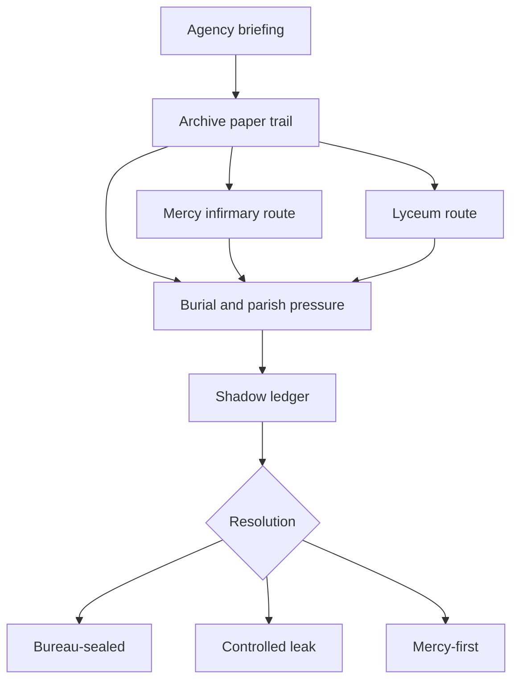

# Quest: Dead Registry

## Premise

Investigate a quiet Agency assignment about civic death-record contradictions and determine whether Freiburg is hiding clerical fraud, political containment, or a shadow register for people the city once declared dead and later wrote back into circulation.

## Entry Conditions

- `agency_briefing_complete=true`
- `bank_investigation_complete=true`
- return to [[00_Map_Room/loc_agency|loc_agency]] after the first serious bank anomaly pass

## Stage Table

| Stage                    | Goal                                                              | Primary Anchor                                                                 |
| ------------------------ | ----------------------------------------------------------------- | ------------------------------------------------------------------------------ |
| stage_00_briefing        | Receive the quiet bureau file and Weber's pattern warning         | [[10_Narrative/Scenes/node_dead_registry_briefing|node_dead_registry_briefing]] |
| stage_01_paper_trail     | Prove that the mismatch is systemic and identify the chemist node | [[10_Narrative/Scenes/node_dead_registry_archive|node_dead_registry_archive]]   |
| stage_02_field_fork      | Open mercy, lyceum, and burial-pressure routes                    | [[10_Narrative/Scenes/node_dead_registry_infirmary|node_dead_registry_infirmary]] / [[10_Narrative/Scenes/node_dead_registry_lyceum|node_dead_registry_lyceum]] / [[10_Narrative/Scenes/node_dead_registry_grave_or_parish|node_dead_registry_grave_or_parish]] |
| stage_03_witness_pressure| Confront the living-dead witness and test rational explanations   | [[10_Narrative/Scenes/node_dead_registry_grave_or_parish|node_dead_registry_grave_or_parish]] |
| stage_04_shadow_ledger   | Surface the off-ledger civic register                             | [[10_Narrative/Scenes/node_dead_registry_shadow_ledger|node_dead_registry_shadow_ledger]] |
| stage_05_resolution      | Decide who controls the truth and what survives the cleanup       | [[10_Narrative/Scenes/node_dead_registry_resolution|node_dead_registry_resolution]] |

## Rational Readings Before Reveal

- pension and salary fraud hidden inside duplicate death certificates
- wartime misidentification and quiet civic reinstatement
- church, hospital, and school offices protecting damaged witnesses through illegal paperwork
- Chancellery containment of a scandal too embarrassing to admit publicly

The quest should preserve at least two of these readings as fully plausible until the witness-pressure stage.

## Failure and Recovery

- If archive access tightens, player can continue through Mercy testimony or press-route leverage without hard lock.
- If the lyceum interview collapses, classroom search and payroll comparison still preserve the chemist thread.
- If witness trust drops, a bureau-sealed route remains possible through document proof rather than public testimony.
- No branch is allowed to hard-solve the bank case; the chemistry thread stays suggestive, not conclusive.

## Rewards

- side-rumor chain:
  - `rumor_dead_registry_duplicates`
  - `rumor_returned_chemist`
  - `rumor_bank_thermite_teacher`
- clue cluster:
  - `clue_double_burial_number`
  - `clue_mercy_memory_gap`
  - `clue_thermite_lecture_notes`
  - `clue_redacted_service_leave`
  - `clue_shadow_registry`
- faction pressure across `city_chancellery`, `chapter_of_mercy`, `city_network`, and hidden `the_returned`
- bank-side hook that verifies the chemistry teacher as a plausible thermite-capable actor without naming him as the confirmed vault intruder

## Related Nodes

- [[10_Narrative/Scenes/node_case1_bank_investigation|node_case1_bank_investigation]]
- [[10_Narrative/Scenes/node_dead_registry_briefing|node_dead_registry_briefing]]
- [[10_Narrative/Scenes/node_dead_registry_archive|node_dead_registry_archive]]
- [[10_Narrative/Scenes/node_dead_registry_infirmary|node_dead_registry_infirmary]]
- [[10_Narrative/Scenes/node_dead_registry_lyceum|node_dead_registry_lyceum]]
- [[10_Narrative/Scenes/node_dead_registry_grave_or_parish|node_dead_registry_grave_or_parish]]
- [[10_Narrative/Scenes/node_dead_registry_shadow_ledger|node_dead_registry_shadow_ledger]]
- [[10_Narrative/Scenes/node_dead_registry_resolution|node_dead_registry_resolution]]

## Flow

## Bank Hook

The chemistry master should emerge as a technically credible bank-adjacent figure:

- he understands high-temperature breach chemistry beyond classroom level
- his records show a long unexplained disappearance and quiet reinstatement
- his military past makes thermite knowledge believable
- none of this proves he opened the vault

That ambiguity must survive the quest and improve the bank case by pressure and suspicion, not by collapse into a solved culprit.
