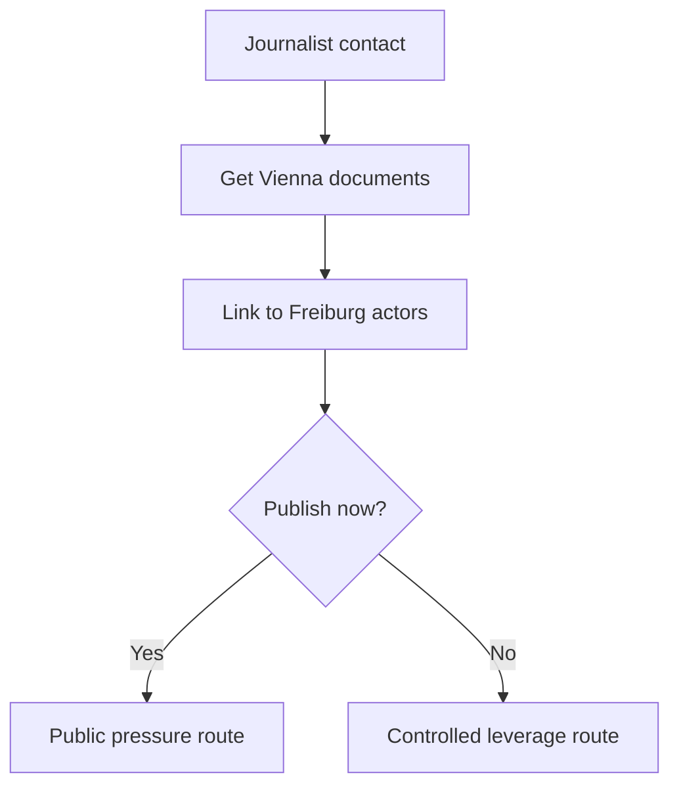

# Quest: Inspector Vienna Backchannel

## Premise

Leverage Anna Mahler and archive sources to uncover a Vienna-linked financial pattern relevant to the Freiburg case.

## Entry Conditions

- `node_intro_journalist_origin` seen OR journalist trust threshold met
- archive access available

## Stage Table

| Stage                    | Goal                                              | Primary Anchor               |
| ------------------------ | ------------------------------------------------- | ---------------------------- |
| stage_00_contact         | Establish reliable journalist backchannel         | node_intro_journalist_origin |
| stage_01_documents       | Acquire Vienna reference documents                | loc_freiburg_archive         |
| stage_02_linkage         | Tie Vienna pattern to local actors                | Mind Palace deduction stage  |
| stage_03_publish_or_hold | Choose publication timing and operational fallout | journalist decision branch   |

## Failure and Recovery

- If journalist trust drops, restore via verified evidence exchange.
- If archive access blocked, route through noble patron sponsorship.

## Rewards

- High-value evidence branch
- Press faction reputation and alternate finale framing

## Related Nodes

- [[10_Narrative/Scenes/node_case1_bank_investigation|node_case1_bank_investigation]]
- [[10_Narrative/Scenes/node_case1_first_lead_selection|node_case1_first_lead_selection]]
- [[10_Narrative/Case_01_Evidence_Graph|Case_01_Evidence_Graph]]

## Flow

