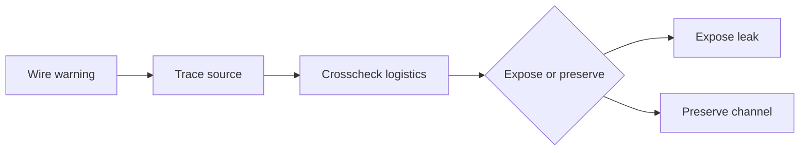

# Quest: Lotte and the Wire Network

## Premise

Track telegraph and switchboard intelligence leaks connected to labor and underworld movement.

## Entry Conditions

- `node_case1_first_lead_selection` reached
- access to telegraph-side content (`loc_telephone` unlock path)

## Stage Table

| Stage               | Goal                                             | Primary Anchor           |
| ------------------- | ------------------------------------------------ | ------------------------ |
| stage_00_signal     | Receive warning through indirect wire message    | interlude_lotte_warning  |
| stage_01_trace      | Trace source route across operator logs          | loc_telephone / archives |
| stage_02_crosscheck | Match wire data with street logistics            | workers/pub branches     |
| stage_03_decision   | Expose leak or preserve channel for deeper sting | runtime decision node    |

## Failure and Recovery

- If trace fails, player can purchase rumor_note and retry with better context.
- If exposure route fails politically, preserve-channel route remains valid.

## Rewards

- New travel intelligence
- Faction deltas across police/underworld/workers

## Related Nodes

- [[10_Narrative/Scenes/node_case1_bank_investigation|node_case1_bank_investigation]]
- [[10_Narrative/Scenes/node_case1_first_lead_selection|node_case1_first_lead_selection]]
- [[10_Narrative/Case_01_Evidence_Graph|Case_01_Evidence_Graph]]

## Flow

