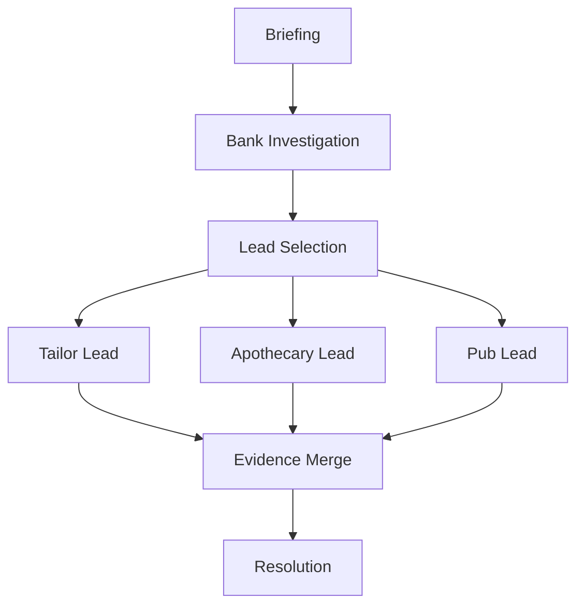

# Quest: Main Case 01 - Bankhaus Krebs

## Premise

Investigate the Bankhaus Krebs incident and determine whether the robbery was staged to hide financial fraud.

## Entry Conditions

- `char_creation_complete=true`
- telegram onboarding chain completed
- `node_case1_alt_briefing_entry` completed

## Stage Table

| Stage                | Goal                                             | Primary Anchor                  |
| -------------------- | ------------------------------------------------ | ------------------------------- |
| stage_00_briefing    | Receive assignment and mission constraints       | node_case1_alt_briefing_entry   |
| stage_01_crime_scene | Investigate bank scene and collect core evidence | node_case1_bank_investigation   |
| stage_02_lead_fork   | Choose first lead: tailor / apothecary / pub     | node_case1_first_lead_selection |
| stage_03_network     | Connect lead outputs into coherent hypothesis    | Case_01_Evidence_Graph          |
| stage_04_resolution  | Confront responsible actor and lock outcome      | finale runtime node             |

## Failure and Recovery

- No critical-path hard fail: each failed check must redirect to a slower but viable evidence route.
- Night-access blocks must offer alternatives (`lockpick`, `bribe`, `warrant`).

## Rewards

- XP progression
- Faction reputation deltas
- Unlock of mid-case network nodes and finale route

## Related Nodes

- [[10_Narrative/Scenes/node_case1_bank_investigation|node_case1_bank_investigation]]
- [[10_Narrative/Scenes/node_case1_first_lead_selection|node_case1_first_lead_selection]]
- [[10_Narrative/Case_01_Evidence_Graph|Case_01_Evidence_Graph]]

## Flow

