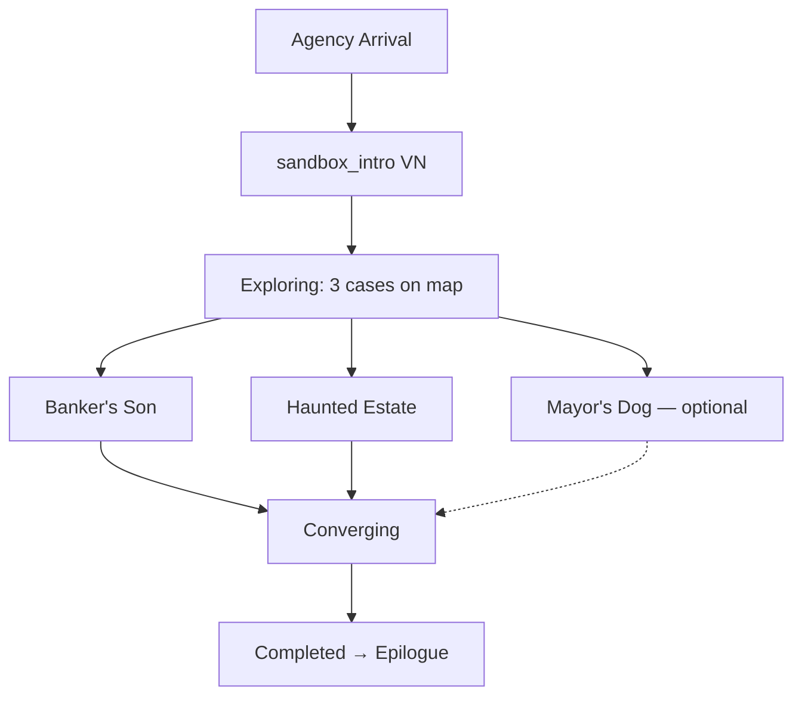

# Quest: Karlsruhe Sandbox (Meta)

## Premise

Tutorial sandbox introducing core detective mechanics across three mini-cases in 1905 Karlsruhe: card duels, evidence combining, and NPC navigation.

## Entry Conditions

- `ka_onboarding_complete=true` (from `/entry/ka1905` onboarding flow)
- `sandbox_intro` VN scenario completed

## Sub-Quests

- [[00_Map_Room/qst_sandbox_banker|qst_sandbox_banker]] — Banker's Son (card duel tutorial)
- [[00_Map_Room/qst_sandbox_dog|qst_sandbox_dog]] — Mayor's Dog (optional, NPC breadcrumbs)
- [[00_Map_Room/qst_sandbox_ghost|qst_sandbox_ghost]] — Haunted Estate (deduction tutorial)

## Stage Table

| Stage      | Goal                           | Trigger                      |
| ---------- | ------------------------------ | ---------------------------- |
| started    | Player enters Karlsruhe agency | `ka_intro_complete` flag     |
| exploring  | Cases unlocked on map          | sandbox_intro VN             |
| converging | At least 2 cases resolved      | `BANKER_DONE` + `GHOST_DONE` |
| completed  | All mechanics demonstrated     | both sub-quests done         |

## Completion Rewards

- XP (3 voices)
- Trait unlock
- Epilogue VN scenario → free roam Karlsruhe

## Flow

## Code References

- Quest logic: `apps/web/src/features/quests/sandbox_meta.logic.ts`
- Quest stages: `packages/shared/data/quests.ts` → `sandbox_karlsruhe`
- Map points: `apps/server/src/scripts/data/sandbox_ka_points.ts`
