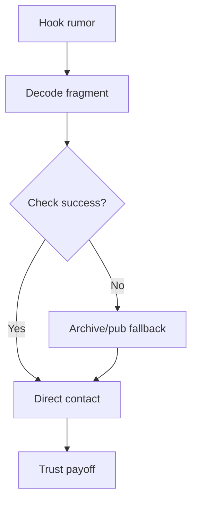

# Quest: Victoria Poetry Thread

## Premise

Use cultural and personal clues from Victoria-linked scenes to decode a hidden social contact chain.

## Entry Conditions

- `node_case1_first_lead_selection` reached
- social hubs unlocked (`loc_workers_pub` or `loc_pub`)

## Stage Table

| Stage            | Goal                                               | Primary Anchor         |
| ---------------- | -------------------------------------------------- | ---------------------- |
| stage_00_hook    | Rumor/encounter establishes Victoria-related motif | loc_workers_pub        |
| stage_01_decode  | Interpret poem fragments and references            | Mind Palace deductions |
| stage_02_contact | Identify the intended recipient and meet safely    | street/interlude node  |
| stage_03_payoff  | Gain trust-based clue or faction shift             | runtime quest resolver |

## Failure and Recovery

- Failed social checks degrade trust but keep decode route available via alternate source.
- If contact meeting fails, player can rebuild route through archive or pub rumors.

## Rewards

- Relationship gains with companion thread
- Optional evidence supporting side-faction hypothesis

## Related Nodes

- [[10_Narrative/Scenes/node_case1_bank_investigation|node_case1_bank_investigation]]
- [[10_Narrative/Scenes/node_case1_first_lead_selection|node_case1_first_lead_selection]]
- [[10_Narrative/Case_01_Evidence_Graph|Case_01_Evidence_Graph]]

## Flow

