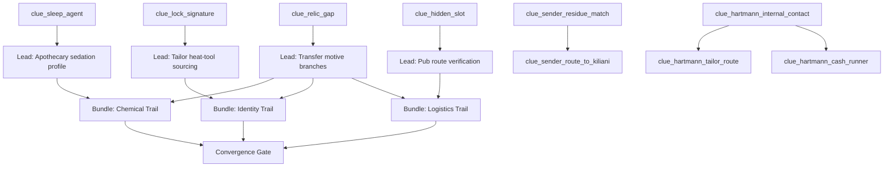

---
id: case_01_evidence_graph
tags:
  - type/graph
  - domain/narrative
  - case/case01
---

# Case 01 Evidence Graph

## Core Links

## Node Anchors

- [[10_Narrative/Scenes/node_case1_bank_investigation|node_case1_bank_investigation]]
- [[10_Narrative/Scenes/node_case1_first_lead_selection|node_case1_first_lead_selection]]
- [[10_Narrative/Scenes/node_case1_lead_tailor|node_case1_lead_tailor]]
- [[10_Narrative/Scenes/node_case1_lead_apothecary|node_case1_lead_apothecary]]
- [[10_Narrative/Scenes/node_case1_lead_pub|node_case1_lead_pub]]
