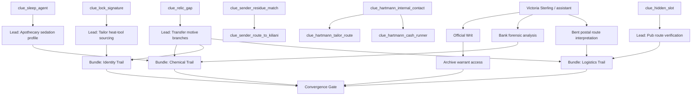

---
id: case_01_evidence_graph
tags:
  - type/graph
  - domain/narrative
  - case/case01
---

# Case 01 Evidence Graph

## Core Links

```mermaid
flowchart TD
  A[clue_sleep_agent] --> B[Lead: Apothecary sedation profile]
  C[clue_lock_signature] --> D[Lead: Tailor heat-tool sourcing]
  E[clue_relic_gap] --> F[Lead: Transfer motive branches]
  G[clue_hidden_slot] --> H[Lead: Pub route verification]

  I[clue_sender_residue_match] --> J[clue_sender_route_to_kiliani]
  K[clue_hartmann_internal_contact] --> L[clue_hartmann_tailor_route]
  K --> M[clue_hartmann_cash_runner]

  B --> N[Bundle: Chemical Trail]
  D --> O[Bundle: Identity Trail]
  H --> P[Bundle: Logistics Trail]
  F --> N
  F --> O
  F --> P

  V[Victoria Sterling / assistant] --> W[Official Writ]
  V --> X[Bank forensic analysis]
  V --> Y[Bent postal route interpretation]
  W --> Z[Archive warrant access]
  X --> N
  Y --> P

  N --> Q[Convergence Gate]
  O --> Q
  P --> Q
  Z --> Q
```

## Node Anchors

- [[10_Narrative/Scenes/node_case1_bank_investigation|node_case1_bank_investigation]]
- [[10_Narrative/Scenes/node_case1_rathaus_hearing|node_case1_rathaus_hearing]]
- [[10_Narrative/Scenes/node_case1_first_lead_selection|node_case1_first_lead_selection]]
- [[10_Narrative/Scenes/node_case1_lead_tailor|node_case1_lead_tailor]]
- [[10_Narrative/Scenes/node_case1_lead_apothecary|node_case1_lead_apothecary]]
- [[10_Narrative/Scenes/node_case1_lead_pub|node_case1_lead_pub]]

## Victoria Integration

- `victoria_sterling` is Victoria Sterling in supported Case 01 scientific
  companion runtime. `assistant` remains a compatibility role key for older
  bridge content, not a fixed person.
- `official_writ_strength` tracks whether the Rathaus writ is merely usable or
  strengthened by respect for Victoria's evidence chain.
- The postal route remains a logistics clue, but Victoria's scientific reading
  frames it as a deliberately bent delivery path rather than innocent confusion.
- Her husband's death is shadow context only; the graph must not resolve that
  mystery in Case 01.
