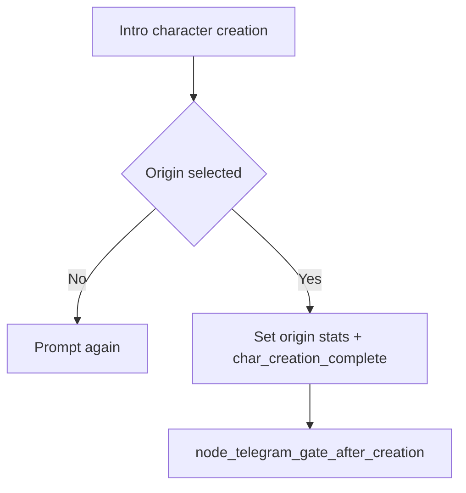

---
id: node_intro_char_creation
aliases:
  - Node: Intro Character Creation
tags:
  - type/node
  - status/active
  - layer/vn
  - phase/start
---

# Node: Intro Character Creation

## Trigger Source

- Route: `/vn/intro_char_creation`
- Source node: [[10_Narrative/Scenes/node_start_game_new_investigation|Start Game - New Investigation]]
- Scenario logic anchor: `apps/web/src/entities/visual-novel/scenarios/detective/creation/intro_char_creation.logic.ts`
- Runtime page anchor: `apps/web/src/pages/VisualNovelPage/VisualNovelPage.tsx`

## Preconditions

- Required flags: none.
- Required evidence/items: none.
- Required quest stage: onboarding start.
- Fallback if missing requirements: route to `node_start_game_new_investigation`.

## Designer View

- Player intent: choose identity/origin and commit to role.
- Narrative function: define initial detective lens.
- Emotional tone: self-definition and first commitment.
- Stakes: affects early roleplay framing and opening flags.

## Mechanics View

- Mechanics used:
  - origin choice scene (`select_origin`);
  - stat assignment actions;
  - completion flag (`char_creation_complete`);
  - end-of-scenario gate.
- Skill checks: none in current build.

## State Delta

- On origin confirm:
  - `set_stat(...)` actions for origin profile;
  - `add_flag(origin_journalist=true)`.
- On scenario end:
  - `add_flag(char_creation_complete=true)`.

## Transitions

- End -> [[10_Narrative/Scenes/node_telegram_gate_after_creation|Telegram Gate After Creation]]

## Validation

- Test anchor:
  - open `/vn/intro_char_creation`;
  - complete flow;
  - verify `char_creation_complete=true`.
- Done criteria:
  - node ends only through explicit END and hands off to telegram gate.

## Branch Diagram

