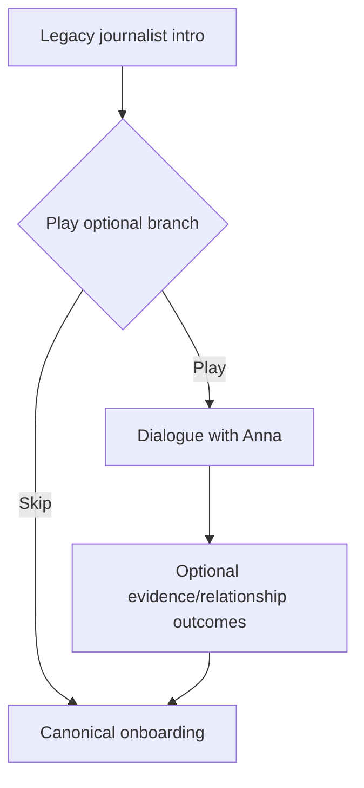

---
id: node_intro_journalist_origin
aliases:
  - Node: Intro Journalist Origin
tags:
  - type/node
  - status/legacy
  - layer/vn
  - phase/origin
---

# Node: Intro Journalist Origin

## Trigger Source

- Route: `/vn/intro_journalist`
- Source: legacy direct navigation/debug flow.
- Scenario logic anchor: `apps/web/src/entities/visual-novel/scenarios/detective/origins/intro_journalist.logic.ts`

## Preconditions

- Required flags: legacy/debug access or optional origin branch trigger.
- Required evidence/items: none.
- Required quest stage: pre-case optional branch.
- Fallback if missing requirements: continue canonical onboarding chain.

## Designer View

- Player intent: play personalized origin flavor before core case loop.
- Narrative function: establish relationship with Anna and seed key rumor evidence.
- Emotional tone: conspiratorial, intimate, uneasy.

## Mechanics View

- Mechanics used:
  - branch choices in cafe scene;
  - relationship delta (`modify_relationship`);
  - evidence reward (`ev_bank_master_key`);
  - map unlock (`loc_rathaus`);
  - completion flag (`met_anna_intro`).

## State Delta

- Potential:
  - `anna_knows_secret=true`
  - `used_shivers_intro=true`
  - `met_anna_intro=true`
  - unlocked `loc_rathaus`
  - evidence `ev_bank_master_key`

## Transitions

- END -> map progression (via VN page end flow to `/map`).

## Validation

- Test anchor:
  - play both choice branches and verify flags/evidence/unlock state.
- Done criteria:
  - origin branch changes state in measurable way and exits cleanly to map.

## Branch Diagram

