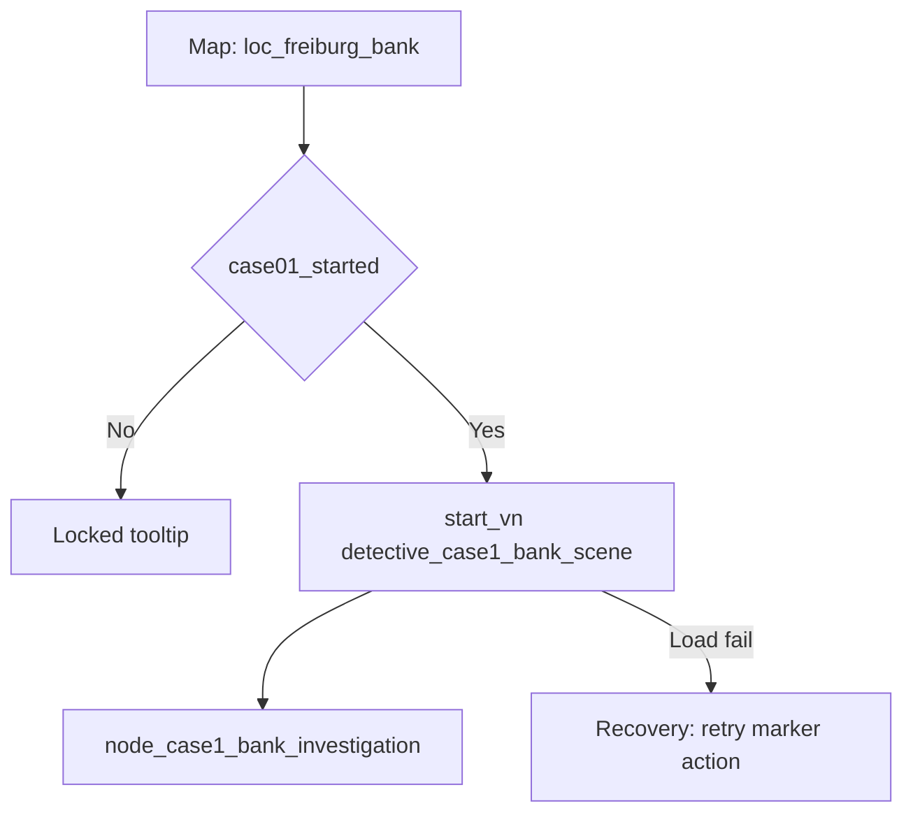

---
id: node_map_action_bank_crime_scene
aliases:
  - Node: Map Action - Bank Crime Scene
tags:
  - type/node
  - status/active
  - layer/map
  - phase/case01
---

# Node: Map Action - Bank Crime Scene

## Trigger Source

- Route: `/map`
- Entry condition:
  - `case01_started=true` (from alt briefing)
  - bank point is visible/unlocked for player
- Map binding anchor:
  - `apps/server/src/scripts/data/case_01_points.ts`
  - point action `start_vn -> detective_case1_bank_scene`
- Runtime execution anchor:
  - `apps/web/src/widgets/map/map-view/MapView.tsx` (`handleExecuteAction`)

## Preconditions

- Required flags: `case01_started=true`.
- Required evidence/items: none.
- Required quest stage: case opening objective active.
- Fallback if missing requirements: show locked tooltip and briefing route.

## Designer View

- Player intent: go to primary crime scene and start active fieldwork.
- Narrative function: shift from briefing exposition to first real investigation loop.
- Emotional tone: urgency and first-contact tension.

## Mechanics View

- Mechanics used:
  - map marker click;
  - interaction resolver;
  - `start_vn` action dispatch;
  - fullscreen VN transition.
- Skill checks: none on map click itself.

## State Delta

- On action:
  - selected point marked visited;
  - `VISITED_<pointId>` flag may be set;
  - scenario starts: `detective_case1_bank_scene`.

## Transitions

- Investigate Crime Scene -> [[10_Narrative/Scenes/node_case1_bank_investigation|Node: Case 1 Bank Investigation]]

## Validation

- Test anchor:
  - from `/map`, click bank point action and verify route to `/vn/detective_case1_bank_scene` (fullscreen case flow).
- Done criteria:
  - point interaction deterministically enters bank investigation scenario.

## Branch Diagram

