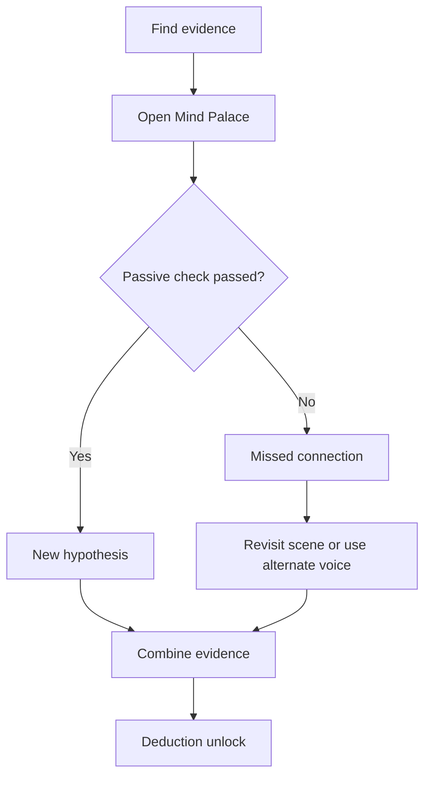

---
id: deduction_table
tags:
  - type/system
  - domain/investigation
---

# Mind Palace Deduction Table

## Evidence Combination Matrix

| Evidence A               | Evidence B            | Deduction C                                                 | Unlock                               |
| ------------------------ | --------------------- | ----------------------------------------------------------- | ------------------------------------ |
| `ev_torn_velvet`         | `ev_witness_rumor`    | Costume route tied to social disguise network               | `loc_tailor`                         |
| `ev_chemical_residue`    | `ev_witness_rumor`    | Medical supply chain likely used for staging                | `loc_apothecary`                     |
| `ev_torn_velvet`         | `ev_chemical_residue` | Scene was curated, not spontaneous                          | `mind_hypothesis_staged_crime`       |
| `ev_tailor_ledger_entry` | `ev_chemical_residue` | Tailor and supply channels intersect through intermediaries | `loc_student_house`                  |
| `ev_bank_master_key`     | `ev_torn_velvet`      | Insider access combined with external execution team        | `mind_hypothesis_internal_collusion` |

## Passive Checks by Scene/Location

| Scene / Location       | Voice        | DC  | On Success                         | On Fail                             |
| ---------------------- | ------------ | --- | ---------------------------------- | ----------------------------------- |
| `loc_freiburg_bank`    | logic        | 8   | Ledger mismatch is exposed         | Case narrative remains ambiguous    |
| `loc_tailor`           | perception   | 7   | Hidden seam clue appears           | Must revisit with stronger evidence |
| `loc_apothecary`       | senses       | 8   | Ether trace links supplier chain   | Chemical link stays speculative     |
| `loc_workers_pub`      | charisma     | 8   | Rumor resolves into named contact  | Rumor remains unverified noise      |
| `loc_freiburg_archive` | encyclopedia | 9   | Charter loophole opens legal route | Bureaucratic dead time increases    |

## Deduction Flow

