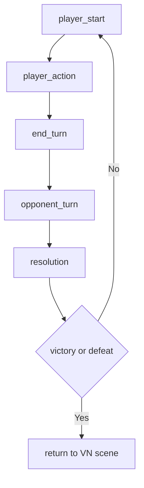

# Sys Battle

## Назначение

Управлять карточным конфликтом (dialogue duel) как отдельным боевым runtime-контуром, который запускается из narrative/map flow и возвращает управляемый исход назад в сценарий.

## Границы ответственности

- Внутри системы:
  - turn-phase loop (`player_action`, `opponent_turn`, `victory/defeat`);
  - AP/Resolve/Block и card effects;
  - battle visual events/log.
- Вне системы:
  - world travel/time/progression API;
  - map point резолв;
  - парламентный AI additive слой.

## Входы

- `BattleScenario` и card registry data.
- Battle launch context (scenario id и return scene hook).
- Действия игрока: play card / end turn.

## Выходы

- Обновленное battle state (player/opponent/turn).
- Победа/поражение и return context в VN flow.
- Журнал боя и visual queue для UI.

## Основной цикл

## Инварианты и safety

- Resolve не должен уходить ниже 0.
- Эффекты карт применяются атомарно в рамках одного действия.
- Defeat branch обязан возвращать в recoverable narrative state.

## Runtime contour

- Источник сценариев и карт:
  - `packages/shared/data/battle.ts`
- Core runtime store:
  - `apps/web/src/entities/battle/model/store.ts`
- UI/runtime entrypoint:
  - `apps/web/src/pages/BattlePage/BattlePage.tsx`

## Balance table (рабочий baseline)

| Scenario               | Player Resolve | Opponent Resolve | AP  | Cards/Turn | Difficulty |
| ---------------------- | -------------- | ---------------- | --- | ---------- | ---------- |
| `detective_skirmish`   | 25             | 20               | 3   | 2          | Easy       |
| `detective_boss_krebs` | 30             | 35               | 3   | 2          | Boss       |

## Тесты/проверка

- `apps/web/src/entities/battle/model/store.ts` (runtime contract inspection)
- `apps/web/src/pages/BattlePage/BattlePage.tsx` (UI/play loop verification)
- `packages/shared/data/battle.ts` (scenario/card data validation)

## Связанные заметки

- [[20_Game_Design/Systems/Combat|Combat Notes]]
- [[20_Game_Design/90_Game_Loops/Loop_Conflict|Loop Conflict]]
- [[99_System/MOC_Engines|MOC Engines]]
