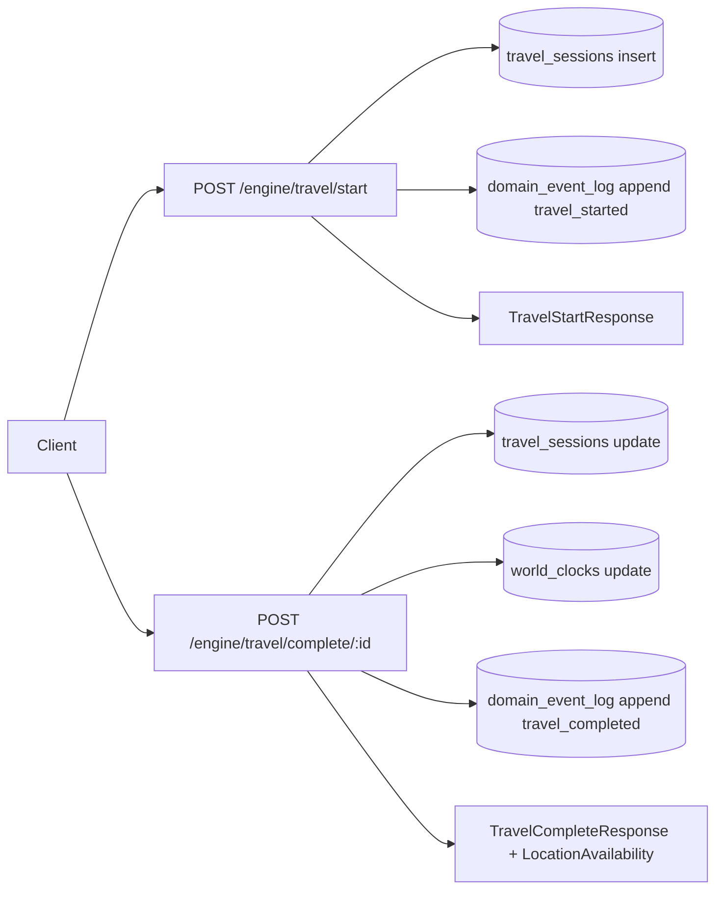

# API Engine Contract

## Scope

This note tracks the active API and runtime contracts used by detective gameplay.

Code anchors:

- server engine endpoints: `apps/server/src/modules/engine.ts`
- server parliament endpoints: `apps/server/src/modules/parliament-ai.ts`
- web runtime orchestrator: `apps/web/src/features/detective/runtime/orchestrator.ts`
- shared runtime types: `packages/shared/lib/runtime.types.ts`
- contracts re-export: `packages/contracts/runtime.ts`

Linked specs:

- [[99_System/Runtime_Orchestrator_v2|Runtime Orchestrator v2]]
- [[99_System/Source_of_Truth|Source of Truth]]

## Endpoint Catalog

### Engine (`/engine`)

### `GET /engine/world`

- Query:
  - `caseId?: string`
- Response `200`:
  - `WorldSnapshotResponse`
  - includes: `worldClock`, `player`, `factions`, `relations`, `activeCase`, `objectives`, `evidence`
- Errors:
  - implicit `500` on repository/runtime failures

### `POST /engine/time/tick`

- Body:
  - `actionType: interrogate | search | travel | scene_major | wait`
  - `ticks?: number`
- Response `200`:
  - `TimeTickResponse`
- Errors:
  - schema validation errors from Elysia body contract

### `POST /engine/travel/start`

- Body:
  - `fromLocationId: string`
  - `toLocationId: string`
  - `mode?: walk | tram | carriage`
  - `caseId?: string`
- Response `200`:
  - `TravelStartResponse`
- Errors:
  - schema validation errors
  - runtime persistence failure (throws)

### `POST /engine/travel/complete/:sessionId`

- Params:
  - `sessionId: string`
- Response `200`:
  - `TravelCompleteResponse`
- Errors:
  - `404`: travel session not found
  - `409`: session already finished
  - `500`: completion persistence failed

### `POST /engine/case/advance`

- Body:
  - `caseId: string`
  - `nextObjectiveId: string`
  - `locationId?: string`
  - `approach?: standard | lockpick | bribe | warrant`
- Response `200`:
  - `CaseAdvanceResponse`
  - blocked variant when bank/night rules fail
- Errors:
  - schema validation errors

### `POST /engine/progress/apply`

- Body:
  - `xp?: number`
  - `voiceXp?: Array<{ voiceId: string; xp: number }>`
  - `factionDelta?: Array<{ factionId: string; delta: number }>`
  - `relationDelta?: Array<{ characterId: string; delta: number }>`
- Response `200`:
  - `ApplyProgressionResponse`
- Errors:
  - schema validation errors

### `POST /engine/evidence/discover`

- Body:
  - `evidenceId: string`
  - `sourceSceneId?: string`
  - `sourceEventId?: string`
- Response `200`:
  - `DiscoverEvidenceResponse`
- Errors:
  - logical `success=false` when evidence id is unknown
  - schema validation errors

### Parliament AI (`/api/parliament`)

### `POST /api/parliament/thought`

- Purpose:
  - non-blocking additive thought line generation
- Request core:
  - `voiceId`, `outcome`, `sceneId`
- Request race-safe extension:
  - `clientEventId?: string`
  - `sceneEpoch?: number`
  - `commandId?: string`
  - `scopeId?: string`
- Response:
  - `text`, `voiceId`, `generated`
  - echo fields: `clientEventId?`, `sceneEpoch?`
  - `eventType?`, `quota?`
- Behavior:
  - invalid/stale responses are dropped client-side by epoch and event-id guards

### `GET /api/parliament/thought/history`

- Purpose:
  - user-scoped thought history with filters and pagination

### `GET /api/parliament/health`

- Purpose:
  - probe model/rate-limit availability
- Security:
  - admin token required

## Runtime Contract (Client Side)

Canonical action model:

- `DomainAction` from `packages/shared/lib/runtime.types.ts`

Hot-path delta model:

- `StateDeltaPatch[]` (patch-based, no full-store merge in runtime apply path)

Concurrency context:

- `EffectContext = { commandId, scopeId, runtimeEpoch, scenarioId, scenarioEpoch, sceneId, sceneEpoch }`

Commit API:

- `dispatch(action | action[], options): RuntimeCommitResult`
- `cancelScope(scopeId): void`
- `getRuntimeState(): RuntimeStateSnapshot`

## Engine Data Flow

## Notes

- User identity is resolved per request via `resolveUserId(...)` and ensured in DB.
- World time uses deterministic phase rotation (`morning/day/evening/night`) with `TICKS_PER_PHASE=3`.
- Case gating includes explicit soft-fail for bank access at night with alternatives.
- Late AI output is additive only and must never mutate deterministic state if stale.
